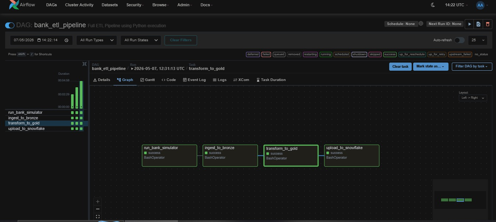
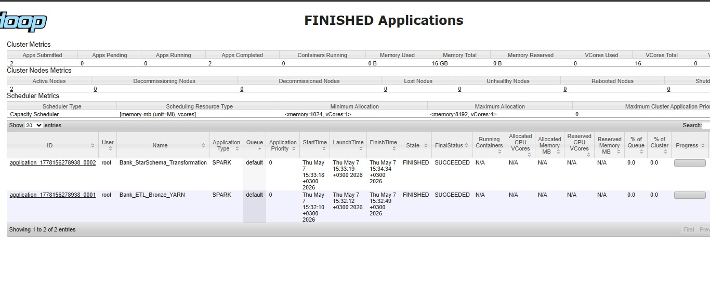
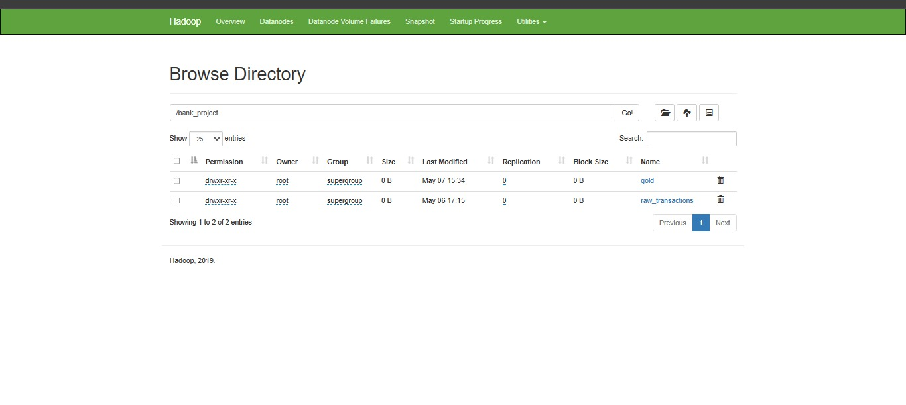
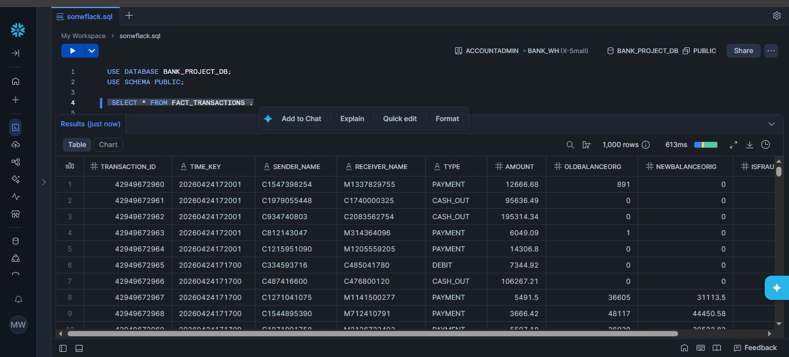

# 🏦 End-to-End Bank Transactions ETL Pipeline

This project demonstrates a high-fidelity **Big Data ETL Pipeline** for processing bank transactions. It automates the data flow from a local simulator to a **Cloud Data Warehouse (Snowflake)** using a **Medallion Architecture** (Bronze/Gold layers).

---

## 🏗️ System Architecture

This pipeline follows a modern **Lakehouse Architecture** divided into three distinct layers:

1. **Data Generation:** A Python script (`bank_simulator.py`) generates mock transactional data in **JSON** format.
2. **Ingestion (Bronze):** Raw JSON data is ingested from local storage and saved in **HDFS** for persistence using Spark.
3. **Processing (Gold):** **PySpark** cleans the data, transforms it into a **Star Schema** (Fact & Dimensions), and saves it as optimized **Parquet** files in HDFS.
4. **Cloud Loading:** The final structured data is loaded into **Snowflake** Cloud Data Warehouse via JDBC for advanced analytics.
5. **Orchestration:** **Apache Airflow** manages, schedules, and automates the entire workflow.

---

## 📊 Data Modeling (Star Schema)

The data is structured to ensure high-performance analytical queries:

* **Fact Table:** `FACT_TRANSACTIONS` – Contains transaction amounts, balances, and fraud flags.
* **Dimension Tables:**
    * `DIM_ACCOUNTS`: Unique account information and types.
    * `DIM_CUSTOMERS`: Unique sender and receiver demographics.
    * `DIM_DATE`: Temporal details including Hour, Day, Month, Year, and Weekday for trend analysis.

---

## 🛠️ Tech Stack & Environment
* **Infrastructure:** Docker & Docker-Compose (WSL2 Ubuntu).
* **Storage:** HDFS (Hadoop Distributed File System).
* **Processing:** Apache Spark (PySpark running on YARN/Local).
* **Orchestration:** Apache Airflow.
* **Data Warehouse:** Snowflake.

---

## ✅ Final Validation
* **Execution Status:** All Airflow tasks completed successfully (Green DAG).
* **Data Integrity:** High-volume records (up to 20,000) successfully processed and verified in Snowflake.

---

## 📸 Execution & Validation Screenshots

### 1. Airflow Orchestration (DAG Run)
Successful execution of the entire DAG, moving data from simulator to cloud.

### 2. Infrastructure & Job Monitoring (Hadoop/Yarn)
Validation that the Spark jobs ran successfully on the distributed cluster.

### 3. Data Storage (HDFS Directory Structure)
Proof of data persistence in HDFS, showing both `raw_transactions` (Bronze) and `gold` layers.

### 4. Final Data Load (Snowflake Verification)
Final validation in Snowflake, showing the loaded data with verification queries.

 
